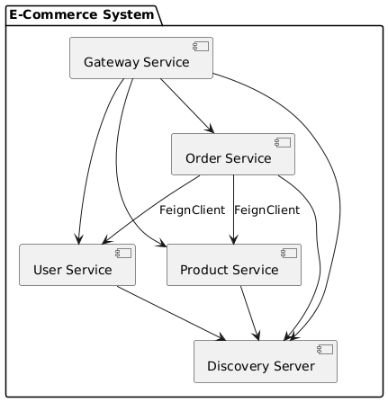

# Proyecto Microservicios: e-commerce

## Descripción General
Este proyecto es una arquitectura basada en microservicios desarrollada con Spring Boot, diseñada para realización 
de compras y  la generación de tickets.  
Incluye múltiples servicios independientes que se comunican mediante Feign y utilizan Eureka para el descubrimiento de servicios.

## Microservicios Incluidos
- **Eureka Server:** Servicio de descubrimiento que registra y permite la localización dinámica de otros 
  microservicios.  
- **API Gateway:** Punto de entrada único para las peticiones del cliente, que enruta a los microservicios correspondientes.
- **User Service:** Gestiona usuarios.
- **Order Service:** Administra pedidos y su procesamiento.
- **Product service:** Controla el inventario de productos.
  
## Link GitHub Repositorio
- [Eureka Server](https://github.com/IronHackProject/discovery-server)
- [API Gateway](https://github.com/IronHackProject/gateway)  
- [User Service](https://github.com/IronHackProject/user-service)
- [Order Service](https://github.com/IronHackProject/order-service)
- [Product Service](https://github.com/IronHackProject/product-service)
## Arquitectura Técnica
- Cada microservicio es una aplicación Spring Boot independiente corriendo en diferentes puertos.
- Comunicación entre servicios basada en Feign Clients y Eureka.
- Persistencia con Spring Data JPA y MySQL en los servicios que requieren almacenamiento.
- Validación, manejo de errores y pruebas unitarias avanzadas con JUnit y Mockito.

## Diagrama UML
)  
Imagen UML Proyecto

## Requisitos para Ejecutar el Proyecto
- Java 21 o superior
- Maven
- MySQL (configurar bases de datos para cada servicio)
- Postman (para pruebas de API)

## Instrucciones de Instalación y Ejecución
1. Clonar el repositorio.
2. Configurar las bases de datos 
3. Ejecutar Eureka Server 
4. Ejecutar API Gateway
5. Ejecutar otros microservicios en el orden que prefieras.
6. Probar con Postman usando la colección disponible en el repositorio `.github/static/e-commerce.postman_collection.
json`.

## Gestión de Tareas
El proyecto se gestiona con Trello y puede consultarse en:  
[Trello Tablero](https://trello.com/b/P0ZVjgZX/e-commerce)

## Tecnologías Utilizadas
- Java 21
- Spring Boot 2.x/3.x
- Spring Cloud Netflix (Eureka, Feign)
- Spring Data JPA
- Validate con Hibernate Validator
- ControllerAdvice para manejo de errores
- MySQL
- JUnit 5, Mockito, MockMvc
- Postman para pruebas API
- UML con PlantUML
- Trello para gestión de tareas

## Futuras Mejoras
- Implementación de seguridad con Spring Security.
- Implementacion de pagos.
- Integración de servicios de terceros (p.ej. envío de correos, SMS).

---
## Enlace a la Presentación
[e-commerce](https://docs.google.com/presentation/d/1EFOl62I8_-0BbTv7zDkMNcjHWulOWwlyTAvnHPrRZsE/edit?usp=sharing)

## Autor
- **Nombre:** [DevJerryX](https://github.com/planetWeb252)
